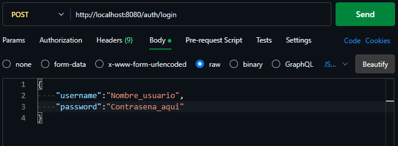

# Login-SysSam
Login create with Java Spring Boot for project bussines

---

# Sistema de Login con Spring Boot

Este es un proyecto de ejemplo que implementa un sistema de login utilizando Spring Boot. El proyecto utiliza Spring Security para gestionar la autenticación y la autorización de los usuarios.

[](https://img.shields.io/badge/python-purple?logo=java) [](https://img.shields.io/badge/html5-purple?logo=spring) [](https://img.shields.io/github/languages/count/BryanSagbay/ServiceOpenAI?color=c90e21 "Langua") [](https://img.shields.io/github/repo-size/bryansagbay/serviceopenai?color=56BEB8 "Gut") [](https://img.shields.io/github/stars/bryansagbay/serviceopenaI?color=blue "Start") 

## Requisitos

- Java JDK 21 o superior instalado en tu sistema.
- Maven para gestionar las dependencias del proyecto.
- Un IDE compatible con Java, como IntelliJ IDEA o Eclipse.

## Configuración

1. Clona este repositorio en tu máquina local:

```bash
git clone https://github.com/tu-usuario/sistema-login-spring-boot.git
```

2. Abre el proyecto en tu IDE preferido.

3. Configura la conexión a la base de datos en el archivo `application.properties`:

```properties
spring.datasource.url=jdbc:mysql://localhost:3306/tu_base_de_datos
spring.datasource.username=tu_usuario
spring.datasource.password=tu_contraseña
```

4. Ejecuta la aplicación Spring Boot:

```bash
mvn spring-boot:run
```

## Uso

Una vez que la aplicación esté en ejecución, puedes consumir este servicio mediante una herrmamienta o mediante el cosumo de la API-Rest, primero debes registrarte en este enlace `http://localhost:8080/register` y para acceder al login debes ingresar en `http://localhost:8080/login`. Aquí podrás ingresar las credenciales de usuario para autenticarte en el sistema.


--- 

